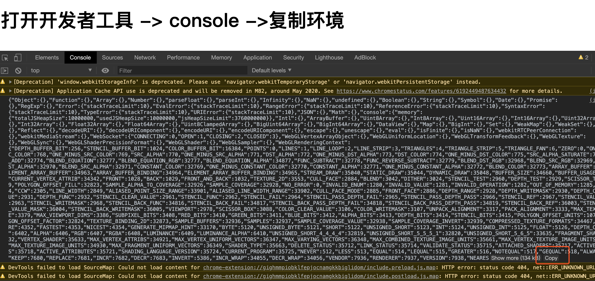

## 背景

之前爬虫 驱动个selenium基本上就可以了.

但是现在各种检测浏览器环境...特别是不熟悉js的同学就更烦了

本文是直接把 selenium pyppeteer 以及正常打开浏览器 的环境差异直接列出来

这样你就可以更愉快的爬虫了（可以直接把环境全部模拟上,或者大概看看有啥,下次看人家混淆js的时候心里有个数）


## 原理

就是遍历window对象,把属性全部保存成json文件


```js
function recur(obj) {
    var result = {},
        _tmp;
    for (var i in obj) {
        // enabledPlugin is too nested, also skip functions
        if (i === 'enabledPlugin' || typeof obj[i] === 'function') {
            continue;
        } else if (typeof obj[i] === 'object') {
            // get props recursively
            _tmp = recur(obj[i]);
            // if object is not {}
            if (Object.keys(_tmp).length) {
                result[i] = _tmp;
            }
        } else {
            // string, number or boolean
            result[i] = obj[i];
        }
    }
    return result;
}

function go() {

    var j = new Object();
    var propertys = Object.getOwnPropertyNames(window);

    propertys.forEach(element => {
        if (element === 'globalThis' ||
            element === 'Illegal' ||
            element === 'parent' ||
            element === 'top' ||
            element === 'frames' ||
            element === 'self' ||
            element === 'window' ||
            element === 'document'
        ) {} else {
            eval("j." + element + "=recur(window." + element + ")")
        }
    });

    console.log(JSON.stringify(j))

}
go()
```

然后分别正常打开,selenium打开，pyppeteer打开

再查看方法的差异

## 操作

### 获取json

下载本项目

启动本地server `python -m http.server 80` 

打开 http://localhost/

正常打开最好是无痕模式,因为浏览器扩展可能会导致多出很多浏览器扩展的属性

打开网页以后 -> 打开开发者工具 -> 切换到console

然后点击copy,粘贴json到对应的文件内



selenium pyppeteer 打开可以参考`getEnvironment.py`

### 比较

直接运行 `python diff.py`就可以了.

下面可以看到 

差异有

root['navigator']['webdriver'], root['clientInformation']['webdriver'] 等等

这个算是目前检测用的比较多的,还有一些其他的可以自己运行看看

```
selenuim 与正常环境的差异
############################################################
{ 'dictionary_item_added': [root['cdc_adoQpoasnfa76pfcZLmcfl_Symbol'], root['cdc_adoQpoasnfa76pfcZLmcfl_Array'], root['cdc_adoQpoasnfa76pfcZLmcfl_Promise'], root['navigator']['webdriver'], root['clientInformation']['webdriver']],
  'dictionary_item_removed': [root['chrome']['runtime'], root['navigator']['doNotTrack'], root['navigator']['languages']['2'], root['clientInformation']['doNotTrack'], root['clientInformation']['languages']['2']],
  'type_changes': { "root['visualViewport']['height']": { 'new_type': <class 'int'>,
                                                          'new_value': 948,
                                                          'old_type': <class 'float'>,
                                                          'old_value': 751.2000122070312}},
  'values_changed': { "root['clientInformation']['connection']['downlink']": { 'new_value': 1.3,
                                                                               'old_value': 1.45},
                      "root['screen']['availHeight']": { 'new_value': 1027,
                                                         'old_value': 1050},
                      "root['screen']['availTop']": { 'new_value': 23,
                                                      'old_value': 0},
                      "root['visualViewport']['width']": { 'new_value': 840,
                                                           'old_value': 1344}}}
pyppeteer 与正常环境的差异
############################################################
{ 'dictionary_item_added': [root['WebKitAnimationEvent'], root['RTCRtpContributingSource'], root['SVGDiscardElement'], root['MediaCapabilitiesInfo'], root['WebKitTransitionEvent'], root['chrome']['webstore'], root['navigator']['webdriver'], root['clientInformation']['webdriver']],
  'dictionary_item_removed': [root['BackgroundFetchManager'], root['RTCPeerConnectionIceErrorEvent'], root['WritableStreamDefaultWriter'], root['XRDOMOverlayState'], root['TrustedTypePolicy'], root['GeolocationCoordinates'], root['External'], root['ClipboardItem'], root['XRTransientInputHitTestSource'], root['XRRay'], root['PerformanceElementTiming'], root['XRViewerPose'], root['RTCError'], root['TextDecoderStream'], root['BackgroundFetchRegistration'], root['TrustedHTML'], root['onpointerrawupdate'], root['XRSession'], root['XRSessionEvent'], root['XRReferenceSpaceEvent'], root['XRReferenceSpace'], root['BarcodeDetector'], root['SubmitEvent'], root['AnimationEffect'], root['PeriodicSyncManager'], root['onformdata'], root['onselectstart'], root['TrustedScriptURL'], root['XRRenderState'], root['SpeechSynthesisErrorEvent'], root['RTCIceTransport'], root['TextEncoderStream'], root['MediaSession'], root['XRHitTestSource'], root['GeolocationPositionError'], root['XRPose'], root['XRView'], root['ElementInternals'], root['XRInputSourceArray'], root['XRInputSourceEvent'], root['XRFrame'], root['DecompressionStream'], root['TrustedScript'], root['Geolocation'], root['TrustedTypePolicyFactory'], root['XRBoundedReferenceSpace'], root['FeaturePolicy'], root['PerformanceEventTiming'], root['LargestContentfulPaint'], root['VideoPlaybackQuality'], root['onselectionchange'], root['XRSpace'], root['XRInputSourcesChangeEvent'], root['GeolocationPosition'], root['XRViewport'], root['XRHitTestResult'], root['queueMicrotask'], root['XRWebGLLayer'], root['DeviceMotionEventRotationRate'], root['ReadableStreamDefaultReader'], root['BackgroundFetchRecord'], root['LayoutShift'], root['DeviceMotionEventAcceleration'], root['MediaMetadata'], root['XRTransientInputHitTestResult'], root['PaymentMethodChangeEvent'], root['trustedTypes'], root['FragmentDirective'], root['UserActivation'], root['RTCErrorEvent'], root['CompressionStream'], root['XRRigidTransform'], root['Animation'], root['RTCSctpTransport'], root['XRInputSource'], root['FormDataEvent'], root['XRSystem'], root['EnterPictureInPictureEvent'], root['KeyframeEffect'], root['RTCDtlsTransport'], root['chrome']['runtime'], root['SVGFEBlendElement']['SVG_FEBLEND_MODE_OVERLAY'], root['SVGFEBlendElement']['SVG_FEBLEND_MODE_HUE'], root['SVGFEBlendElement']['SVG_FEBLEND_MODE_SATURATION'], root['SVGFEBlendElement']['SVG_FEBLEND_MODE_COLOR_DODGE'], root['SVGFEBlendElement']['SVG_FEBLEND_MODE_LUMINOSITY'], root['SVGFEBlendElement']['SVG_FEBLEND_MODE_EXCLUSION'], root['SVGFEBlendElement']['SVG_FEBLEND_MODE_DIFFERENCE'], root['SVGFEBlendElement']['SVG_FEBLEND_MODE_SOFT_LIGHT'], root['SVGFEBlendElement']['SVG_FEBLEND_MODE_HARD_LIGHT'], root['SVGFEBlendElement']['SVG_FEBLEND_MODE_COLOR_BURN'], root['SVGFEBlendElement']['SVG_FEBLEND_MODE_COLOR'], root['navigator']['userActivation'], root['navigator']['doNotTrack'], root['navigator']['mediaSession'], root['navigator']['languages']['2'], root['clientInformation']['userActivation'], root['clientInformation']['doNotTrack'], root['clientInformation']['mediaSession'], root['clientInformation']['languages']['2'], root['PerformanceObserver']['supportedEntryTypes']],
  'type_changes': { "root['visualViewport']['height']": { 'new_type': <class 'int'>,
                                                          'new_value': 600,
                                                          'old_type': <class 'float'>,
                                                          'old_value': 751.2000122070312}},
  'values_changed': { "root['clientInformation']['appVersion']": { 'new_value': '5.0 '
                                                                                '(Macintosh; '
                                                                                'Intel '
                                                                                'Mac '
                                                                                'OS '
                                                                                'X '
                                                                                '10_15_4) '
                                                                                'AppleWebKit/537.36 '
                                                                                '(KHTML, '
                                                                                'like '
                                                                                'Gecko) '
                                                                                'Chrome/71.0.3542.0 '
                                                                                'Safari/537.36',
                                                                   'old_value': '5.0 '
                                                                                '(Macintosh; '
                                                                                'Intel '
                                                                                'Mac '
                                                                                'OS '
                                                                                'X '
                                                                                '10_15_4) '
                                                                                'AppleWebKit/537.36 '
                                                                                '(KHTML, '
                                                                                'like '
                                                                                'Gecko) '
                                                                                'Chrome/83.0.4103.61 '
                                                                                'Safari/537.36'},
                      "root['clientInformation']['connection']['rtt']": { 'new_value': 100,
                                                                          'old_value': 150},
                      "root['clientInformation']['plugins']['0']['name']": { 'new_value': 'Chromium '
                                                                                          'PDF '
                                                                                          'Plugin',
                                                                             'old_value': 'Chrome '
                                                                                          'PDF '
                                                                                          'Plugin'},
                      "root['clientInformation']['plugins']['1']['name']": { 'new_value': 'Chromium '
                                                                                          'PDF '
                                                                                          'Viewer',
                                                                             'old_value': 'Chrome '
                                                                                          'PDF '
                                                                                          'Viewer'},
                      "root['clientInformation']['userAgent']": { 'new_value': 'Mozilla/5.0 '
                                                                               '(Macintosh; '
                                                                               'Intel '
                                                                               'Mac '
                                                                               'OS '
                                                                               'X '
                                                                               '10_15_4) '
                                                                               'AppleWebKit/537.36 '
                                                                               '(KHTML, '
                                                                               'like '
                                                                               'Gecko) '
                                                                               'Chrome/71.0.3542.0 '
                                                                               'Safari/537.36',
                                                                  'old_value': 'Mozilla/5.0 '
                                                                               '(Macintosh; '
                                                                               'Intel '
                                                                               'Mac '
                                                                               'OS '
                                                                               'X '
                                                                               '10_15_4) '
                                                                               'AppleWebKit/537.36 '
                                                                               '(KHTML, '
                                                                               'like '
                                                                               'Gecko) '
                                                                               'Chrome/83.0.4103.61 '
                                                                               'Safari/537.36'},
                      "root['console']['memory']['jsHeapSizeLimit']": { 'new_value': 2330000000,
                                                                        'old_value': 3760000000},
                      "root['history']['length']": { 'new_value': 2,
                                                     'old_value': 3},
                      "root['location']['href']": { 'new_value': 'http://localhost/',
                                                    'old_value': 'http://localhost/t.html'},
                      "root['location']['pathname']": { 'new_value': '/',
                                                        'old_value': '/t.html'},
                      "root['navigator']['appVersion']": { 'new_value': '5.0 '
                                                                        '(Macintosh; '
                                                                        'Intel '
                                                                        'Mac '
                                                                        'OS X '
                                                                        '10_15_4) '
                                                                        'AppleWebKit/537.36 '
                                                                        '(KHTML, '
                                                                        'like '
                                                                        'Gecko) '
                                                                        'Chrome/71.0.3542.0 '
                                                                        'Safari/537.36',
                                                           'old_value': '5.0 '
                                                                        '(Macintosh; '
                                                                        'Intel '
                                                                        'Mac '
                                                                        'OS X '
                                                                        '10_15_4) '
                                                                        'AppleWebKit/537.36 '
                                                                        '(KHTML, '
                                                                        'like '
                                                                        'Gecko) '
                                                                        'Chrome/83.0.4103.61 '
                                                                        'Safari/537.36'},
                      "root['navigator']['connection']['rtt']": { 'new_value': 100,
                                                                  'old_value': 150},
                      "root['navigator']['plugins']['0']['name']": { 'new_value': 'Chromium '
                                                                                  'PDF '
                                                                                  'Plugin',
                                                                     'old_value': 'Chrome '
                                                                                  'PDF '
                                                                                  'Plugin'},
                      "root['navigator']['plugins']['1']['name']": { 'new_value': 'Chromium '
                                                                                  'PDF '
                                                                                  'Viewer',
                                                                     'old_value': 'Chrome '
                                                                                  'PDF '
                                                                                  'Viewer'},
                      "root['screen']['availHeight']": { 'new_value': 1027,
                                                         'old_value': 1050},
                      "root['screen']['availTop']": { 'new_value': 23,
                                                      'old_value': 0},
                      "root['screen']['colorDepth']": { 'new_value': 24,
                                                        'old_value': 30},
                      "root['screen']['orientation']['type']": { 'new_value': 'portrait-primary',
                                                                 'old_value': 'landscape-primary'},
                      "root['screen']['pixelDepth']": { 'new_value': 24,
                                                        'old_value': 30},
                      "root['visualViewport']['width']": { 'new_value': 800,
                                                           'old_value': 1344}}}
```


 
